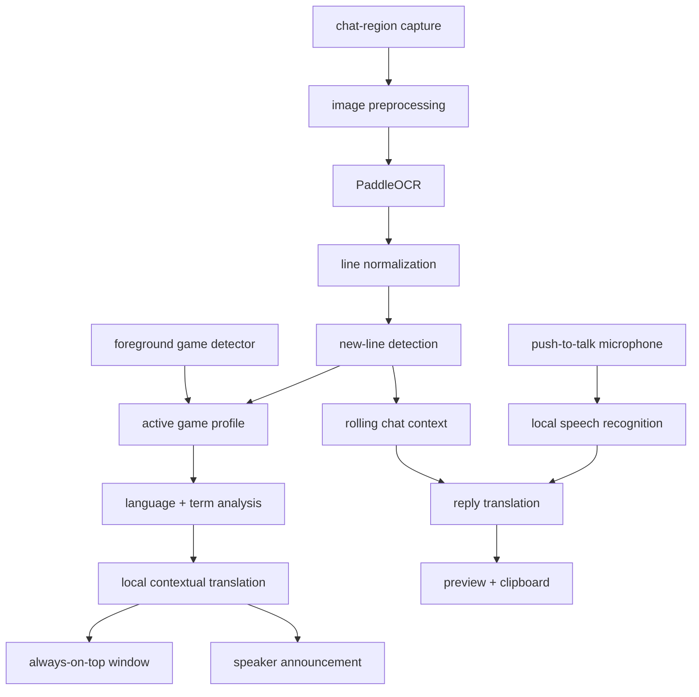

# game chat translator — project architecture

status: build-ready specification  
architecture version: 1.1
target platform: windows 10/11  
primary use case: detect and translate multilingual in-game chat into natural gamer english, preserving slang, tone, profanity, game terminology, names, and formatting, then display and optionally read it aloud. stalzone is the first fully tuned game profile, not a permanent limitation of the core engine.

cost constraint: the complete default application must operate locally with free/open-source components and no paid APIs, subscriptions, accounts, or per-message charges.

## 1. product goal

build a small external desktop companion that:

- captures only a user-selected chat region.
- recognizes Cyrillic and Latin-script chat, with expandable language packs.
- detects newly appeared chat lines without repeating old ones.
- detects the language of each message, including mixed-language messages.
- translates intended meaning into concise, natural gamer English instead of awkward literal English.
- uses recent conversation context and a stalzone glossary to resolve slang and game terms.
- shows translations in a separate always-on-top window.
- optionally reads translations aloud.
- announces messages in the form `<player> said: <natural English translation>`.
- lets the user speak a reply, translates it into the selected player's language, and copies the result to the clipboard.
- never reads game memory, injects code, hooks rendering, or automates game input.

### product direction

- run primarily as a background Windows tray application.
- expose a compact dashboard for setup, status, profiles, models, hotkeys, audio, history, and diagnostics.
- ship a generic-game profile plus individually tuned game profiles.
- detect the currently focused supported game and activate its profile automatically.
- keep the core capture/OCR/translation/voice pipeline game-agnostic.
- make game-specific behavior data-driven so adding Minecraft or another game does not require forking the application.
- distribute through one Windows installer executable that creates the installed application, tray shortcut, uninstaller, and optional startup entry.

## 2. v1 scope

### included

- windows desktop application.
- system-tray process that continues working while the dashboard is closed.
- dashboard that can be reopened from the tray icon.
- one-time drag-to-select chat region, with manual coordinate editing.
- capture every 400–750 ms while enabled.
- image preprocessing tuned for stalzone chat.
- multilingual OCR with Cyrillic and Latin enabled by default.
- new-line detection and duplicate suppression.
- fully local contextual translation with a lightweight offline fallback.
- compact always-on-top translation window.
- start/stop, mute/unmute, and clear-history hotkeys.
- hold-to-talk voice replies with speaker/language targeting and clipboard output.
- reply preview, copy confirmation, and easy correction before pasting into the game.
- generic-game profile and first-party stalzone profile.
- first-party Minecraft Java profile as the second-game proof; manual calibration remains available for customized chat layouts.
- profile selector and profile creation/import/export controls.
- first-run wizard for chat-region selection, audio test, hold-to-talk key, hardware detection, and model/profile download.
- foreground-game detection and automatic profile/layout switching.
- saved chat-region calibrations per game, resolution, display scale, and game UI scale.
- settings persisted locally.
- local logs useful for debugging OCR accuracy.

### excluded from v1

- game-process access, DLL injection, renderer hooks, or memory reading.
- automatic replies or simulated keyboard input.
- translation of the entire screen.
- macOS or Linux support.
- cloud accounts, syncing, or analytics.
- paid translation, speech, or language-model APIs.
- automatically clicking player names, opening chat, pasting, or pressing Enter.
- packaging through the Microsoft Store.
- tuned built-in profiles for games other than STALZONE and Minecraft Java.

## 3. recommended stack

| area | v1 choice | reason |
| --- | --- | --- |
| language | Python 3.12 | fastest path to a reliable Windows prototype |
| capture | `dxcam`, with `mss` fallback | fast DirectX capture; fallback improves compatibility |
| image processing | OpenCV + Pillow | thresholding, scaling, color masks, and debug images |
| OCR | PaddleOCR with script/language routing | strong Cyrillic support with expandable multilingual models |
| language identification | fastText, plus script heuristics | free local per-message detection with mixed-language fallback |
| contextual translation | bundled `llama.cpp`-compatible runtime with a validated multilingual GGUF model | avoids requiring Ollama or another separately installed service while preserving local slang/context quality |
| lightweight translation | Argos Translate | free offline fallback for machines that cannot run a local LLM well |
| voice recognition | faster-whisper | free local multilingual speech-to-text with CPU/GPU options |
| text-to-speech | Windows SAPI through `pywin32` | built into Windows, offline, and avoids another speech service |
| UI | PySide6 | better window, tray, hotkey, and packaging support than tkinter |
| global hotkeys | `pynput` | configurable controls outside the focused window |
| game detection | Win32 foreground-window APIs through `pywin32` | identifies focused executable/window metadata without reading game memory |
| reply delivery | Qt clipboard | does not simulate game input and lets the user verify the recipient/message |
| settings | versioned JSON via Pydantic models | human-readable typed configuration |
| runtime state | SQLite with explicit migrations | durable calibrations, learned terms, model metadata, and optional bounded history need transactional updates |
| dependency locking | `uv.lock` generated from `pyproject.toml` | reproducible developer, CI, and packaging environments |
| application packaging | PyInstaller one-folder build | bundles Python/runtime dependencies without requiring Python on the user's PC |
| installer | Inno Setup | produces one familiar Windows setup executable with shortcuts and uninstall support |
| tests | pytest | unit and integration coverage |

the OCR, language-identification, translation, glossary, and speech engines will sit behind interfaces. providers can be replaced without changing capture, line tracking, or the UI.

all dependency and model versions are pinned only after the first Windows compatibility build. PaddleOCR 3.x is a deliberate API boundary and must not be implemented from obsolete 2.x examples.

translation modes:

| mode | behavior | tradeoff |
| --- | --- | --- |
| local contextual | recent chat + glossary + local multilingual model | best slang/context quality; needs more RAM/GPU |
| lightweight offline | Argos model + glossary substitutions | lower hardware use; weaker on slang and ambiguity |
| untranslated | preserve original text and announce detection failure | reliable fallback when no language model is installed |

## 4. system flow



### architectural invariants

- core domain objects and events are typed, immutable, provider-neutral structures.
- UI classes depend on application services and event interfaces, never directly on OCR, capture, translation, speech, or Win32 implementations.
- each mutable subsystem has one owner thread/task; workers communicate through bounded queues and cancellation tokens.
- every external model/provider call has a timeout, cancellation path, health state, and deterministic fallback.
- persisted settings, database rows, profiles, glossaries, corpora, and model manifests carry schema versions and have validation/migration tests.
- normal shutdown drains or cancels workers in a defined order and never leaves microphone capture, hotkeys, or model processes running.
- startup can recover from a corrupt config, interrupted model download, unavailable GPU provider, missing profile, or stale calibration without crashing the tray process.
- no game-specific conditional logic belongs in the core pipeline when the behavior can be represented by a validated profile.

## 5. component responsibilities

### `capture`

- capture only the configured monitor and rectangle.
- account for Windows display scaling and multi-monitor coordinates.
- return frames with timestamps.
- pause cleanly when capture is disabled or the game is minimized.

### `preprocess`

- upscale the crop 2× or 3×.
- optionally isolate likely chat-text colors.
- improve contrast and sharpness.
- expose several preprocessing profiles because chat backgrounds vary.
- save debug frames only when diagnostic mode is enabled.

### `ocr`

- recognize Cyrillic and Latin text by default.
- allow additional OCR language packs without changing the pipeline.
- preserve mixed-script spans, item names, usernames, numbers, symbols, and emoticons.
- return text, confidence, and bounding boxes.
- group OCR fragments into visual lines from top to bottom.
- reject very low-confidence fragments and obvious UI noise.

### `line_tracker`

- normalize whitespace and harmless punctuation differences.
- compare current lines against a rolling history, not a permanent `set`.
- use fuzzy similarity plus vertical order to survive minor OCR changes.
- emit only genuinely new lines.
- expire old fingerprints after a configurable period.

this avoids the main flaw in the minimal prototype: a permanent `seen` set would suppress a legitimate repeated message forever and would grow without bound.

### `message_classifier`

- classify every detected line as `player_inbound`, `player_outbound`, `system`, or `unknown`.
- announce only `player_inbound` messages by default.
- identify player messages using username/message layout, separators, direction markers, OCR boxes, and chat colors.
- identify system messages using their distinct layout/colors plus a versioned set of known patterns such as login, logout, item, event, and detector notifications.
- suppress the user's own outgoing messages.
- default uncertain lines to visible-but-silent instead of reading likely system noise aloud.
- expose a diagnostic action to mark a false classification and improve fixture coverage.

### `game_profile`

- define each game's chat layouts, colors, separators, direction markers, username rules, system-message patterns, glossary, preprocessing presets, and crop hints.
- use a versioned manifest schema with a stable profile ID such as `stalzone.default` or `minecraft.java`.
- inherit from `generic.default` so every profile needs to specify only its differences.
- keep profiles as data files; no profile may execute arbitrary code.
- let users create, clone, edit, import, and export profiles from the dashboard.
- let profile updates ship independently from application releases.
- fall back to manual region selection and conservative message classification when no tuned profile exists.
- define executable, window-title, and window-class matchers used by automatic detection.
- store multiple named chat-layout presets and user calibrations for different resolutions and UI scales.
- allow a profile to declare optional visual anchors that help locate a visible chat box without assuming fixed coordinates.

### `game_detector`

- observe the current foreground window through documented Windows metadata APIs.
- resolve executable name, window title, window class, monitor, client bounds, and DPI scale.
- never read process memory, inject code, hook graphics, or inspect network traffic.
- match only against detection rules declared by installed profiles.
- use executable identity as the strongest signal, then window class/title for ambiguous processes.
- handle generic hosts such as Minecraft's `javaw.exe` using window title/class plus the user's saved association.
- switch only after the same candidate remains focused for a short debounce interval.
- pause capture when no supported/configured game is focused unless the user pins a profile manually.
- let the user override auto-detection, pin a profile, or disable automatic switching.
- retain no general application-usage history and avoid logging unrelated window titles by default.

### `layout_resolver`

- choose a saved calibration using profile ID, monitor, client resolution, DPI scale, and game UI scale when known.
- transform normalized chat coordinates when only window size changes proportionally.
- validate the selected region with profile-specific colors/anchors before announcing text.
- request a one-time drag-to-select calibration when confidence is insufficient.
- support multiple layouts per game, such as `default`, `large-chat`, `ultrawide`, or user-named presets.
- account for resizable chat boxes such as Minecraft by treating coordinates as user-specific profile state.

### `region_calibrator`

- launch from the dashboard's `Calibrate Chat Area` action or first-run wizard.
- capture one frozen screenshot of the active game window or selected monitor through the normal capture backend.
- display the frozen frame in a borderless clipping interface rather than injecting an overlay into the game.
- dim everything outside the selected rectangle and use a crosshair cursor while drawing.
- support click-drag creation, move, resize handles, keyboard nudging, Reset, Cancel/Escape, and Save/Enter.
- show the selected crop at enlarged scale alongside live preprocessing and sample OCR output.
- require a non-empty region and warn when no likely chat text is detected, while still allowing an explicit save.
- encourage calibration while several representative player and system messages are visible.
- store normalized client-area coordinates plus the original client size, monitor, DPI scale, and profile/layout IDs.
- convert normalized client coordinates back to screen coordinates whenever the game window moves or resizes.
- preserve separate calibrations for fullscreen, borderless, windowed, ultrawide, and user-named layouts.
- never save the calibration screenshot by default; retain it only when the user explicitly adds it as a diagnostic fixture.

### `translator`

- detect language per message rather than assuming Russian.
- handle code-switching and mixed-language spans inside one message.
- use 3–10 recent messages as bounded conversational context when useful.
- translate intended meaning, not word-for-word grammar.
- preserve tone, profanity strength, jokes, insults, laughter, emoticons, and repeated punctuation.
- correct obvious source-language typos internally without rewriting the displayed source.
- preserve player names, numbers, item names, map names, factions, abbreviations, and game terms.
- never sanitize a message merely because it is rude or profane.
- support an optional literal-translation detail view for debugging.
- enforce timeouts and retry transient failures.
- cache recent translations.
- return the original line unchanged when translation is disabled or unavailable.
- make no network request during normal translation.
- select the best installed local engine automatically and show which engine is active.

### `model_manager`

- maintain a versioned allowlist manifest containing model ID, provider, languages, minimum hardware tier, size, license, source URL, and SHA-256 digest.
- select `cpu_low`, `cpu_balanced`, or `gpu` defaults from a local hardware probe; always let the user override the recommendation.
- download models only during explicit setup/update actions, using a temporary file plus digest verification and atomic rename.
- never execute code from a model package or trust filenames/paths supplied by a remote manifest.
- expose download size, disk requirement, model license, progress, cancellation, retry, and removal controls.
- share compatible models across game profiles and keep the last known working model until its replacement passes a health check.
- fall back in order: contextual local model, lightweight offline translator, original text with a visible error state.

example target behavior:

| source | natural output |
| --- | --- |
| `ты куда идёшь?` | `where are you going?` |
| `нужно хотябы мне потестить сканер` | `i at least need to test out the scanner` |
| `mahmut naber` | `mahmut, what's up?` |
| `ххехех` | `hehehe` |

### `game_glossary`

- ship with a versioned stalzone terminology file.
- load the bundled STALZONE glossary from `data/glossaries/stalzone.v1.json` through the profile manifest rather than hard-coding terms.
- store canonical English names plus Russian, Turkish, transliterated, abbreviated, and misspelled aliases.
- cover maps, factions, artifacts, weapons, armor, events, anomalies, currencies, resources, and common community shorthand.
- prefer official in-game English names when a term has one.
- protect glossary matches from being mistranslated as ordinary words.
- allow user corrections from the UI and save them locally.
- track glossary version separately from the application version.
- resolve terms from three ordered layers: bundled profile glossary, optional signed community pack, then the user's local learned overlay.
- never modify bundled files at runtime; application updates can replace them safely while preserving local learning.

### `glossary_learner`

- observe untranslated spans, repeated unknown words, mixed-language game terms, and user corrections after OCR normalization.
- use the local multilingual translator plus surrounding messages to propose a canonical term, language, aliases, category, and confidence score.
- accumulate evidence across separate messages and speakers instead of learning from one occurrence.
- immediately store every proposal in a local candidate database with source language, context hash, first/last seen timestamps, and evidence count.
- automatically activate only high-confidence aliases that map to an existing canonical game term and pass repetition, OCR-stability, and conflict checks.
- require confirmation for new canonical meanings, conflicting mappings, profanity that may be ordinary speech, and low-confidence OCR.
- let users accept, edit, reject, or block candidates from a small `learned terms` screen; rejection prevents repeated prompts for the same evidence.
- support Turkish and other new languages without a new application release when the installed detector and translation model already support them.
- keep learned data local by default. future community sharing must be explicit opt-in, anonymized, reviewable, and separate from normal translation.
- provide export/import of a versioned user glossary overlay so useful terms can later be reviewed for a bundled profile release.
- never learn usernames, numbers, URLs, one-off insults, or entire sentences as glossary terms.

### `context_manager`

- retain a short rolling window of source messages and accepted translations.
- keep speaker, channel, timestamp, detected language, and message direction metadata.
- send only the minimum context needed by contextual translation.
- expire old context and never grow without bound.
- allow context to be cleared instantly from the UI.

### `speaker_tracker`

- parse the player name separately from the message body using chat colors, separators, and OCR boxes.
- associate each foreign-language speaker with their most recently detected language.
- track the most recent inbound speaker as the default reply target.
- allow explicit voice targeting such as `reply to Vasya` when several players are active.
- never guess silently when two targets are equally plausible; show a small target chooser.
- after several consecutive messages from one player, keep that player as the reply target.
- display the active reply target and language before and during voice recording.

### `voice_reply`

- use a configurable hold-to-talk key; `V` is supported when it does not conflict with the user's game controls.
- start recording on key-down and stop recording on key-up.
- observe the key without suppressing it; warn when the selected key also triggers an in-game action.
- ignore accidental presses shorter than a small configurable debounce threshold.
- transcribe the user's English speech locally with faster-whisper.
- accept either a plain reply or a command such as `reply to Vasya: meet me at Forge-11`.
- translate the reply into the target player's last detected language.
- preserve canonical stalzone terms using the same glossary as inbound translation.
- show English transcript, target, language, and translated draft before delivery.
- copy the translated draft to the Windows clipboard automatically after successful translation.
- show a desktop toast such as `copied Russian reply for Vasya_By`.
- let the user paste and press Enter manually in the game.
- never auto-send a low-confidence transcription or ambiguous-recipient reply.
- on failure, leave the clipboard unchanged and show a clear retry notification.

### `announcement_formatter`

- produce speech such as `Vasya said: where are you going?`.
- do not read usernames character-by-character unless pronunciation mode requests it.
- skip repeated system messages and optionally suppress the user's own messages.
- preserve message ordering when several lines arrive together.
- read three consecutive messages as three ordered announcements without dropping or merging them.
- queue new messages that arrive during an active announcement.
- collapse excessive punctuation for speech while leaving the displayed translation unchanged.

### `speech`

- use a non-blocking queue so speech never stalls capture or OCR.
- allow mute, volume, voice, rate, and queue-length controls.
- drop stale messages if speech falls too far behind.
- interrupt or pause announcements while the user records a reply to prevent microphone feedback.
- resume queued inbound announcements after reply recording and processing finishes.

### `ui`

- setup screen for selecting the capture rectangle.
- live preview with OCR bounding boxes in diagnostic mode.
- compact always-on-top translation window.
- system-tray controls and clear status indicators.
- configurable hotkeys and translation/TTS toggles.
- visible last-speaker target and detected language.
- reply transcript, translated draft, copy status, and retry/edit controls.
- small non-blocking clipboard toast that disappears automatically.
- close-to-tray behavior, with a separate explicit Quit action.
- tray menu: Pause/Resume, Mute/Unmute, active game profile, Open Dashboard, and Quit.
- tray status shows detected game/profile and whether its chat layout is calibrated.
- dashboard pages: Status, Capture, Profiles, Translation Models, Audio & Voice, Hotkeys, History, and Diagnostics.
- optional `start with Windows` setting, disabled by default.

### `storage`

- store application data under `%LOCALAPPDATA%/GameChatTranslator/` because profiles, models, logs, and learned state are machine-local.
- store validated user settings in `config.json` using atomic replace and a last-known-good backup.
- store calibrations, learned aliases, glossary candidates, installed-model metadata, profile overrides, and optional bounded history in `state.sqlite3` using WAL mode and numbered migrations.
- keep normal message history memory-only by default; persistence is an explicit opt-in with retention and Clear Now controls.
- keep normal operation local and ephemeral.
- write size-bounded rotating diagnostic logs with no screenshots, microphone audio, clipboard contents, or full chat text by default.
- provide an explicit export-debug-bundle action.
- store installed game profiles and downloaded local models separately from the executable.
- allow profile/model updates without replacing the main executable.
- store user calibrations separately from shipped profiles so profile updates never overwrite local layouts.
- make database migrations forward-only during normal startup and create a backup before any destructive migration.

minimum SQLite tables:

| table | purpose |
| --- | --- |
| `schema_migrations` | applied migration versions and timestamps |
| `calibrations` | normalized client-relative regions keyed by profile/layout/display metadata |
| `learned_terms` | active user aliases and provenance/confidence metadata |
| `glossary_candidates` | pending, accepted, rejected, or blocked learning proposals |
| `installed_models` | verified model path, digest, provider, license, and health state |
| `profile_overrides` | user changes kept separate from signed/bundled profiles |
| `message_history` | optional bounded history only when persistence is enabled |

## 6. concurrency model

the UI thread must never run OCR, translation, or TTS directly.

| worker | responsibility | queue behavior |
| --- | --- | --- |
| capture worker | produce the newest cropped frame | capacity 1; replace stale frame |
| OCR worker | preprocess and recognize text | consume latest frame only |
| classifier worker | separate inbound players, outbound players, system, and unknown lines | preserve OCR order |
| translation worker | translate new lines | bounded FIFO |
| speech worker | read every translated inbound player message in order | bounded FIFO; never drop normal queued chat |
| microphone worker | record only during push-to-talk | one active recording |
| voice recognition worker | transcribe completed recordings | bounded FIFO |
| reply worker | resolve target and translate outbound text | one draft at a time |
| UI thread | render status and translations | receive signals/events only |

### application lifecycle

| state | allowed work | exit condition |
| --- | --- | --- |
| `starting` | load config, migrate storage, validate profiles, register tray | required services initialized or a recoverable setup error is shown |
| `needs_setup` | dashboard, calibration, model setup, diagnostics | minimum profile, region, and OCR model are ready |
| `paused` | UI, tray, configuration, model management | user resumes and a supported/manual profile is available |
| `monitoring` | foreground detection, capture, OCR, classification, translation, TTS | pause, calibration, model change, fatal worker failure, or shutdown |
| `recording_reply` | microphone capture; inbound TTS paused | hold-to-talk key released or recording cancelled |
| `processing_reply` | STT, target resolution, translation, preview/clipboard | draft completed, failed, cancelled, or replaced |
| `degraded` | UI plus surviving providers/fallbacks | provider health recovers, user changes configuration, or shutdown |
| `stopping` | cancel producers, drain bounded user-visible work, unregister hooks, close models/database | process exits |

events and service interfaces are specified in `docs/runtime_contracts.md`. no worker may pass raw provider-specific response objects across subsystem boundaries.

## 7. proposed repository layout

```text
chat-translator/
├── README.md
├── project_architecture.md
├── BUILD_PLAN.md
├── LICENSE
├── pyproject.toml
├── uv.lock
├── docs/
│   └── runtime_contracts.md
├── src/
│   └── game_chat_translator/
│       ├── __main__.py
│       ├── app.py
│       ├── models.py
│       ├── settings.py
│       ├── events.py
│       ├── lifecycle.py
│       ├── capture/
│       │   ├── base.py
│       │   ├── dxcam_capture.py
│       │   └── mss_capture.py
│       ├── vision/
│       │   ├── preprocess.py
│       │   ├── paddle_ocr.py
│       │   └── line_tracker.py
│       ├── language/
│       │   ├── detector.py
│       │   ├── mixed_script.py
│       │   ├── glossary.py
│       │   └── glossary_learner.py
│       ├── profiles/
│       │   ├── schema.py
│       │   ├── loader.py
│       │   ├── manager.py
│       │   └── validator.py
│       ├── detection/
│       │   ├── foreground_window.py
│       │   ├── game_detector.py
│       │   ├── layout_resolver.py
│       │   └── region_calibrator.py
│       ├── translation/
│       │   ├── base.py
│       │   ├── llama_cpp_local.py
│       │   ├── argos_translate.py
│       │   └── router.py
│       ├── model_management/
│       │   ├── manifest.py
│       │   ├── hardware.py
│       │   ├── downloader.py
│       │   └── manager.py
│       ├── storage/
│       │   ├── database.py
│       │   ├── repositories.py
│       │   └── migrations/
│       ├── voice/
│       │   ├── recorder.py
│       │   ├── faster_whisper_stt.py
│       │   ├── command_parser.py
│       │   └── reply_controller.py
│       ├── conversation/
│       │   ├── context_manager.py
│       │   ├── message_classifier.py
│       │   ├── speaker_tracker.py
│       │   └── announcement.py
│       ├── speech/
│       │   ├── base.py
│       │   └── windows_tts.py
│       └── ui/
│           ├── main_window.py
│           ├── region_selector.py
│           ├── calibration_window.py
│           ├── calibration_preview.py
│           ├── translation_window.py
│           ├── dashboard.py
│           ├── profile_editor.py
│           ├── first_run_wizard.py
│           └── tray.py
├── tests/
│   ├── fixtures/
│   ├── test_preprocess.py
│   ├── test_line_tracker.py
│   ├── test_language_detection.py
│   ├── test_glossary.py
│   ├── test_translation.py
│   ├── test_message_classifier.py
│   ├── test_profile_schema.py
│   ├── test_profile_loader.py
│   ├── test_game_detector.py
│   ├── test_layout_resolver.py
│   ├── test_region_calibrator.py
│   ├── test_speaker_tracker.py
│   ├── test_voice_commands.py
│   ├── test_reply_controller.py
│   ├── test_settings.py
│   ├── test_storage_migrations.py
│   ├── test_model_manifest.py
│   └── test_lifecycle.py
├── scripts/
│   ├── capture_fixture.py
│   ├── bootstrap.ps1
│   ├── build_windows.ps1
│   └── build_installer.ps1
├── installer/
│   └── game-chat-translator.iss
├── data/
│   ├── README.md
│   ├── corpora/
│   │   └── stalzone.translation.v1.jsonl
│   └── glossaries/
│       └── stalzone.v1.json
├── profiles/
│   ├── generic.default/
│   │   └── profile.json
│   ├── stalzone.default/
│   │   ├── profile.json
│   │   └── system_patterns.json
│   └── minecraft.java/
│       ├── profile.json
│       └── system_patterns.json
├── .github/
│   └── workflows/
│       ├── test.yml
│       └── release-windows.yml
└── assets/
    └── app.ico
```

## 8. configuration model

```json
{
  "application": {
    "close_to_tray": true,
    "start_with_windows": false,
    "active_profile": "stalzone.default",
    "auto_detect_game": true,
    "profile_switch_debounce_ms": 1200,
    "pause_when_no_game_focused": true
  },
  "capture": {
    "backend": "dxcam",
    "monitor": 0,
    "left": 20,
    "top": 930,
    "width": 650,
    "height": 130,
    "interval_ms": 500,
    "region_coordinate_space": "game_client_normalized"
  },
  "ocr": {
    "scripts": ["cyrillic", "latin"],
    "preferred_languages": ["ru", "en", "tr"],
    "minimum_confidence": 0.45,
    "preprocess_profile": "profile_default"
  },
  "translation": {
    "enabled": true,
    "mode": "local_contextual",
    "provider": "llama_cpp",
    "model_id": "auto",
    "source": "auto",
    "target": "en",
    "style": "natural_gamer",
    "context_messages": 6,
    "preserve_profanity": true,
    "show_literal_translation": false,
    "glossary": "profile_default"
  },
  "learning": {
    "enabled": true,
    "automatic_existing_term_aliases": true,
    "minimum_distinct_occurrences": 3,
    "minimum_confidence": 0.9,
    "confirm_new_canonical_terms": true,
    "share_candidates": false
  },
  "reply": {
    "enabled": true,
    "delivery": "clipboard",
    "copy_after_translation": true,
    "default_target": "last_inbound_speaker",
    "require_target_confirmation_when_ambiguous": true,
    "auto_send": false,
    "hold_to_talk": "v",
    "minimum_hold_ms": 180,
    "suppress_key_event": false,
    "show_clipboard_toast": true
  },
  "speech_recognition": {
    "provider": "faster_whisper",
    "model": "small",
    "language": "en",
    "local_only": true
  },
  "speech": {
    "enabled": true,
    "rate": 185,
    "volume": 0.9
  },
  "privacy": {
    "persist_message_history": false,
    "history_retention_days": 0,
    "diagnostic_text_logging": false,
    "save_debug_frames": false,
    "telemetry": false
  },
  "hotkeys": {
    "toggle_capture": "ctrl+shift+t",
    "toggle_speech": "ctrl+shift+m",
    "clear_history": "ctrl+shift+l",
    "hold_to_talk": "v"
  }
}
```

### game-profile manifest example

```json
{
  "schema_version": 1,
  "profile_id": "stalzone.default",
  "display_name": "STALZONE",
  "inherits": "generic.default",
  "detection": {
    "executables": [],
    "window_title_patterns": ["STALZONE"],
    "minimum_confidence": 0.9,
    "status": "executable_pending_verification"
  },
  "chat": {
    "default_anchor": "bottom_left",
    "player_message_separators": [":"],
    "direction_markers": ["->"],
    "announce_outbound": false,
    "announce_system": false
  },
  "resources": {
    "glossary_id": "stalzone.v1",
    "system_patterns": "system_patterns.json"
  },
  "layouts": {
    "strategy": "user_calibration_with_profile_hints",
    "default_anchor": "bottom_left"
  }
}
```

### distribution model

- public download is a single installer such as `GameChatTranslator-Setup-x64.exe`.
- early releases may be unsigned and will publish SHA-256 checksums; Authenticode signing is added only when a trusted certificate is available and is never falsely implied.
- the installer contains the desktop application and lightweight generic, STALZONE, and Minecraft Java profiles.
- the first-run wizard downloads only the free local models selected for the user's hardware.
- downloaded models live in application data and are shared across game profiles.
- normal operation remains offline after required models are installed.
- an optional portable build may be provided later, but the installer is the supported consumer path.
- Windows builds run on Windows because PyInstaller is not a cross-compiler.
- releases include installer checksum, version, changelog, and reproducible build instructions.
- tagged releases trigger a Windows GitHub Actions workflow that runs tests, builds the application and installer, generates checksums, and attaches release assets.
- model/profile manifests bundled with a release contain fixed URLs, licenses, sizes, and SHA-256 digests; an interrupted or mismatched download is never activated.
- v1 checks GitHub Releases only when the user explicitly selects `Check for updates`; it does not run a silent self-updater.
- source users clone the repository and run one documented command: `powershell -ExecutionPolicy Bypass -File .\scripts\bootstrap.ps1`.
- the bootstrap script validates prerequisites, creates an isolated environment, installs pinned dependencies, installs the application for the current user, and reports the launch command.
- source installation is a developer/contributor path; normal users should download the release installer.

### chat-region calibration flow

1. pause live OCR and resolve the active game/profile.
2. take one frozen screenshot of the game client or selected monitor.
3. open the clipping interface over the frozen screenshot.
4. let the user drag, move, and resize a rectangle around the complete chat region.
5. show an enlarged crop, preprocessing variants, and detected OCR lines.
6. let the user retry the screenshot, reset the rectangle, cancel, or save.
7. save coordinates normalized to the game client with resolution/DPI/layout metadata.
8. resume OCR using the saved layout and confirm with a short `chat area calibrated` toast.

the calibration interface must work across multiple monitors and Windows display scaling. absolute desktop coordinates are runtime output only and must not be the persisted source of truth.

## 9. new-line detection design

1. sort OCR boxes by vertical position.
2. merge nearby fragments into visual lines.
3. normalize whitespace, Unicode, and repeated punctuation.
4. generate a comparison form that removes unstable OCR artifacts without changing the displayed text.
5. align the current frame's lines with the previous frame using fuzzy similarity.
6. emit lines that do not align with recent visible or recently emitted lines.
7. keep a short rolling history so identical messages can legitimately appear again later.

initial thresholds will be tuned against captured screenshots rather than guessed permanently.

## 10. translation policy

the default `natural_gamer` policy is part of the product contract:

1. identify the speaker, channel, message body, language, and protected game terms.
2. interpret slang, typos, abbreviations, transliteration, and recent conversational context.
3. translate the meaning into short, normal English a player would actually say.
4. preserve hostility, humor, uncertainty, profanity strength, emoticons, and punctuation intensity.
5. retain canonical stalzone terms and player names exactly.
6. do not add explanations inside the overlay unless the source is genuinely ambiguous.
7. expose the raw OCR text and literal translation only in an expandable debug/detail view.

## 11. inbound and outbound user experience

### inbound message

1. the application watches only the selected stalzone chat region.
2. a new line appears: `Vasya_By: ты куда идёшь?`.
3. OCR extracts the speaker and message, then the tracker confirms it is new.
4. the classifier confirms it is an inbound player message rather than a system or outgoing message.
5. the local translator detects Russian, applies chat context and the game glossary, and produces `where are you going?`.
6. the window displays the natural translation; the original remains available in the detail/history view.
7. TTS says: `Vasya said: where are you going?`.

when Vasya sends three messages consecutively, all three translations enter the speech queue and play one by one in their original order. no message is merged or silently discarded.

### outbound voice reply

1. the user holds `V`; TTS pauses and microphone recording begins immediately.
2. the user says `Forge-11, I need to test my scanner`.
3. the user releases `V`; recording ends and faster-whisper transcribes the speech locally.
4. the speaker tracker uses the most recent inbound player, Vasya, and resolves their last detected language as Russian.
5. the local translator produces a natural Russian reply while preserving `Forge-11` and `scanner` according to the glossary.
6. the Russian draft is copied to the clipboard automatically.
7. a toast says `copied Russian reply for Vasya_By` and the UI retains the English transcript and Russian draft.
8. the user clicks Vasya's name, pastes, verifies, and presses Enter.
9. any queued inbound announcements resume.

## 12. safety and compatibility constraints

- capture through normal Windows screen-capture APIs only.
- use a separate top-level window; do not inject an in-game overlay.
- do not inspect the game process, memory, files, or network traffic.
- do not send keystrokes or automate gameplay.
- do not click player names, focus game windows, paste, or press Enter automatically in v1.
- keep OCR text, microphone audio, transcripts, and translations on the computer by default.
- require an explicit future architecture decision before sending chat/audio content to any network-backed processing provider; model/profile/update downloads are content-free and user initiated.
- never require a paid API for a core feature.
- never auto-send an ambiguous recipient, low-confidence transcript, or low-confidence translation.
- do not overwrite the clipboard when transcription, language detection, targeting, or translation fails.
- do not claim anti-cheat approval without written confirmation from the game publisher. external capture is lower risk, not guaranteed risk-free.

## 13. milestones

| milestone | deliverable | completion test |
| --- | --- | --- |
| m0 — fixtures | representative chat screenshots plus ground-truth annotations | includes multiple languages, slang, typos, profanity, game terms, names, colors, channels, and noisy backgrounds |
| m0.5 — profile foundation | generic profile schema, loader, validator, and stalzone profile | invalid/untrusted profile files fail safely; generic inheritance works |
| m0.75 — game detection | foreground detector, matcher confidence, debounce, overrides, and layout resolver | switching among test windows activates the right profile/layout without recording unrelated app history |
| m0.9 — region calibration | frozen screenshot, drag/resize selection, OCR preview, normalized persistence, and retry/reset/cancel | saved region follows the game window and survives supported resolution/DPI changes |
| m1 — OCR CLI | crop screenshot and print ordered lines | target messages are readable on fixture set |
| m2 — live detector | capture region and emit only new lines | no repeats while unchanged; repeated messages work later |
| m3 — classification | separate inbound player, outbound player, system, and unknown lines | system/outbound fixtures remain silent; inbound fixtures are not missed |
| m4 — language and glossary | detect language and protect canonical terms | mixed Russian/English/Turkish fixtures resolve correctly |
| m5 — local contextual translation | translate into natural gamer English without network calls | slang, tone, profanity, and game-term rubric passes |
| m6 — desktop shell | tray process, dashboard, selector, profile manager, model manager, and settings | closing dashboard keeps tray service running; explicit Quit stops it |
| m7 — inbound speech | announce `<player> said: <translation>` | every consecutive player message is spoken in order; system/outbound lines stay silent |
| m8 — hold-to-talk replies | key-down record, key-up transcribe/translate/copy/toast | no network calls; clipboard unchanged on failure; nothing is auto-sent |
| m9 — hardening | tests, logs, scaling, multi-monitor support | passes fixture and manual gameplay tests |
| m10 — packaging | single Windows installer, first-run wizard, model/profile setup, and uninstaller | clean-machine setup verified with no Python or paid account/API |
| m11 — distribution automation | Windows CI tests, tagged release build, checksums, and release assets | release is reproducible and downloadable from GitHub Releases |
| m12 — Minecraft proof | tune Minecraft Java as the second real profile | foreground detection, resized-chat calibration, and profile/layout switching work with no core-engine fork |

## 14. performance targets

- new translation p95 displayed within 1.5 seconds of a line becoming visible on the documented balanced-hardware tier; lightweight mode p95 within 1.0 second.
- capture/OCR averages under 10% CPU on the documented reference PC after tuning; translation spikes are measured separately.
- bounded memory usage during multi-hour sessions.
- no duplicate translation for a static line across consecutive frames.
- capture and processing stop immediately when paused.
- ordinary voice replies copied within 3 seconds after push-to-talk release on supported hardware.
- no feedback loop where TTS announcements are transcribed as the user's reply.
- supported-game focus changes activate the correct profile within 2 seconds without losing persisted layout state.
- held-out STALZONE player-message recall is at least 95%; system/outbound false announcements are below 1% of classified lines.
- a static frame sequence produces zero duplicate announcements; a legitimate identical message sent later is emitted again.
- at least 90% of reviewed high-confidence corpus rows pass meaning, term-preservation, tone, and no-invention checks; low-confidence rows are reported separately.

performance claims must name the CPU, GPU, RAM, model, capture interval, resolution, and sample size. `supported hardware` is not declared until those measurements exist.

## 15. testing strategy

- treat `data/corpora/stalzone.translation.v1.jsonl` as the initial translation regression corpus, not as executable prompt text or an automatic fine-tuning dataset.
- split corpus rows deterministically into development and held-out evaluation sets; never tune against the held-out expected translations.
- validate every corpus row and glossary entry in CI, including required fields, supported language tags, exactly one expected translation direction, and duplicate aliases.
- test learning thresholds, repeated evidence, alias conflicts, OCR instability, rejection suppression, username exclusion, and bundled/community/local precedence.
- test a Turkish alias discovered during live chat and reused correctly after restart without changing the bundled STALZONE glossary.
- unit tests for normalization, grouping, fuzzy matching, cache expiry, settings, and provider fallbacks.
- golden-image tests using cropped and full-screen chat screenshots.
- every fixture stores raw OCR ground truth, normalized source, language tags, protected terms, and expected natural translation.
- translation quality rubric: meaning, naturalness, slang, tone/profanity, term preservation, and no invented content.
- regression set for Russian, English, Turkish, code-switching, transliteration, deliberate misspellings, laughter, emoticons, and wrapped messages.
- integration tests with recorded frame sequences that simulate chat scrolling.
- recorded voice fixtures for commands, plain replies, accents, noise, corrections, and ambiguous names.
- clipboard tests proving that drafts copy but are never pasted or sent automatically.
- ordered-queue tests with several consecutive player messages plus interleaved system messages.
- key-down/key-up tests for hold recording, accidental taps, autorepeat, focus changes, and a key shared with game controls.
- foreground-window fixtures covering exact matches, generic process hosts, title changes, multiple running games, rapid alt-tab, DPI changes, and unknown applications.
- layout-resolution tests covering 16:9, ultrawide, windowed mode, moved/resized windows, and user-resizable chat boxes.
- calibration tests covering drag directions, resize handles, keyboard nudging, cancel/reset, invalid rectangles, OCR preview failure, multi-monitor coordinates, and DPI scaling.
- offline test with outbound networking blocked; every core workflow must still pass.
- manual tests for fullscreen-windowed mode, DPI scaling, multiple monitors, alt-tab, and game minimization.
- packaging smoke test on a Windows machine without Python installed.

## 16. locked defaults and runtime facts still required

defaults are locked so implementation does not pause for cosmetic choices:

- working product name: `Game Chat Translator`; Python package: `game_chat_translator`; Windows application ID: `com.kazoogh.gamechattranslator`.
- license: Apache-2.0 for original project code; every downloaded model/data dependency keeps its own displayed license and must pass redistribution review.
- translation window shows natural English by default; source text and literal/debug output stay in the expandable detail/history view.
- TTS reads every inbound player message by default and never reads system/outbound/unknown lines unless the user changes filters.
- translation window starts top-right, remains movable/resizable, and persists its geometry per display layout.
- `V` is the initial hold-to-talk default, remains configurable, and triggers a conflict warning when shared with the active game.
- STALZONE and Minecraft Java are the first two tuned profiles.
- no telemetry, cloud sync, automatic sending, or persistent message history is enabled by default.

the following are observed facts, not architecture decisions, and do not block repository scaffolding:

1. target PC CPU, GPU, VRAM, RAM, Windows version, and available disk space.
2. actual STALZONE executable name, window class/title, display resolution, DPI scaling, window mode, and UI scale.
3. representative uncropped/cropped screenshots showing player, outbound, system, item-link, wrapped, and scrolling chat.
4. Minecraft Java process/window metadata and screenshots from its default chat plus at least one resized/custom-scale layout.

## 17. fixture ingestion

screenshots from other ChatGPT chats are useful source material, but they must be made available as actual image files to become reliable automated test fixtures. remembered summaries are not a substitute for pixels or ground-truth annotations.

preferred ingestion order:

1. attach original screenshots to this project/chat or add them to project sources.
2. keep an unmodified private fixture copy during development.
3. annotate each fixture with exact source text, language, natural translation, protected terms, and notes.
4. publish screenshots to the public GitHub repository only after an explicit privacy review; usernames and chat content may be public.

the initial text-only STALZONE assets are versioned separately from screenshots:

- `data/corpora/stalzone.translation.v1.jsonl` contains 211 inbound and outbound examples with natural translations, tone notes, protected terms, and confidence notes.
- `data/glossaries/stalzone.v1.json` contains 77 canonical terms and their observed aliases.
- player-name annotations are removed from the public corpus; tests should use synthetic usernames.
- low-confidence examples remain useful edge cases but must not be treated as authoritative translations without review.

## 18. immediate next step

begin build slice 0 from `BUILD_PLAN.md`: repository scaffold, typed domain contracts, config/storage migrations, data validators, and Windows CI. this work can begin without additional user input.

in parallel, collect 10–20 uncropped STALZONE screenshots at the user's actual resolution, covering:

- Russian, English, Turkish, and other encountered languages.
- mixed-language and transliterated messages.
- slang, profanity, typos, abbreviations, jokes, and insults.
- game terms with known canonical English names.
- repeated messages.
- chat scrolling by one and several lines.
- different locations/background brightness.
- player names, system messages, and channel labels.

these become the permanent OCR fixture set and determine preprocessing and deduplication thresholds for m1.

also collect a smaller Minecraft Java fixture set. screenshots improve OCR tuning but are not required to start the core implementation.

## 19. architecture decision log

| date | decision | rationale |
| --- | --- | --- |
| 2026-08-20 | windows-only v1 | matches the target game environment and minimizes platform complexity |
| 2026-08-20 | separate always-on-top window | avoids injection and is easier to debug and package |
| 2026-08-20 | PaddleOCR as primary OCR | strong Cyrillic support and trainable preprocessing pipeline |
| 2026-08-20 | PySide6 instead of tkinter | stronger desktop UX, tray integration, and worker signaling |
| 2026-08-20 | rolling fuzzy line tracker | handles chat scrolling and OCR instability better than a permanent exact-match set |
| 2026-08-20 | provider interfaces | keeps OCR, translation, capture, and speech engines replaceable |
| 2026-08-20 | multilingual, message-level language detection | real chat already includes Russian, English, Turkish, and mixed text |
| 2026-08-20 | natural gamer English policy | literal translation loses slang, tone, profanity, and conversational intent |
| 2026-08-20 | versioned stalzone glossary | canonical game names must survive translation and community misspellings |
| 2026-08-20 | bounded conversational context | previous lines resolve ambiguity without unbounded data retention |
| 2026-08-20 | zero-cost local-first requirement | core operation must never depend on paid APIs, accounts, subscriptions, or usage fees |
| 2026-08-20 | local LLM plus Argos fallback | local model handles slang/context; Argos supports lower-spec machines |
| 2026-08-20 | push-to-talk replies | avoids continuous microphone use and makes reply intent explicit |
| 2026-08-20 | clipboard delivery for v1 | prevents wrong-recipient auto-sends and avoids simulated in-game input |
| 2026-08-20 | inbound-player-only announcements | system messages and the user's own messages should stay silent |
| 2026-08-20 | ordered speech queue | every consecutive player message must be read exactly once and in order |
| 2026-08-20 | hold-to-talk key lifecycle | key-down records; key-up transcribes, translates, copies, and confirms with a toast |
| 2026-08-20 | tray-first Windows application | background behavior is primary; dashboard is configuration and diagnostics |
| 2026-08-20 | installer instead of giant model-bundled executable | one setup executable preserves easy installation while models remain replaceable and hardware-selectable |
| 2026-08-20 | game-agnostic core plus profiles | stalzone, Minecraft, and future games share one engine and differ through validated data packages |
| 2026-08-20 | generic profile fallback | unsupported games remain usable through manual region selection and conservative classification |
| 2026-08-20 | foreground-window game detection | normal Windows metadata can select profiles without memory reading or injection |
| 2026-08-20 | per-game per-layout calibration | chat geometry varies by resolution, UI scale, window mode, and user customization |
| 2026-08-20 | profile-switch debounce and manual override | avoids alt-tab thrashing and gives users control when detection is ambiguous |
| 2026-08-20 | GitHub Releases plus one-command source bootstrap | end users get an installer while contributors get a repeatable setup path |
| 2026-08-20 | frozen-screenshot clipping calibration | familiar screenshot-style selection avoids injection and gives deterministic visual feedback |
| 2026-08-20 | normalized client-relative chat coordinates | saved layouts remain usable when windows move and can adapt to proportional size changes |
| 2026-08-20 | OCR preview before saving calibration | users can correct a bad region before background monitoring begins |
| 2026-08-20 | layered live glossary learning | bundled data remains reproducible while the app learns personal aliases and languages locally |
| 2026-08-20 | evidence-gated automatic activation | repeated high-confidence aliases may activate automatically; new or ambiguous meanings require confirmation to prevent glossary poisoning |
| 2026-08-20 | embedded `llama.cpp`-compatible provider instead of required Ollama | the release must work without asking normal users to install or manage a separate local-model service |
| 2026-08-20 | JSON configuration plus migrated SQLite state | settings stay readable while learned terms, calibrations, and model metadata update transactionally |
| 2026-08-20 | Windows SAPI for default TTS | provides a free offline voice already available on the target platform |
| 2026-08-20 | Minecraft Java as second v1 profile | its resizable chat proves that calibration/profile abstractions are not STALZONE-specific |
| 2026-08-20 | Apache-2.0 project license | permissive reuse plus an explicit patent grant fits a public extensible desktop project |
| 2026-08-20 | checksummed manual updates before self-update | avoids unsafe silent replacement and does not imply paid code signing is already available |
| 2026-08-20 | build-ready typed runtime contracts | implementation slices share stable events, lifecycle states, fallbacks, and ownership rules |
| 2026-08-20 | pause during profile-switch debounce | a new foreground candidate must never be captured with the prior game's calibration |
| 2026-08-21 | finite opt-in history retention | persisted chat history requires an explicit 1–365 day expiry; zero continues to mean persistence is disabled |
| 2026-08-21 | worker-owned SAPI and serialized storage | COM speech, history writes, geometry writes, model actions, and diagnostics never execute on the Qt UI thread |
| 2026-08-21 | global hotkeys remain Slice 6 | Slice 5 displays configured shortcuts; key observation begins with the hold-to-talk implementation so no partial hook lifecycle ships |
| 2026-08-20 | stable Windows display device names | persisted calibration keys use display device identity rather than transient monitor handles |
| 2026-08-20 | bounded proportional calibration reuse | major aspect-ratio, size, or DPI changes require recalibration instead of silently reusing stale geometry |
