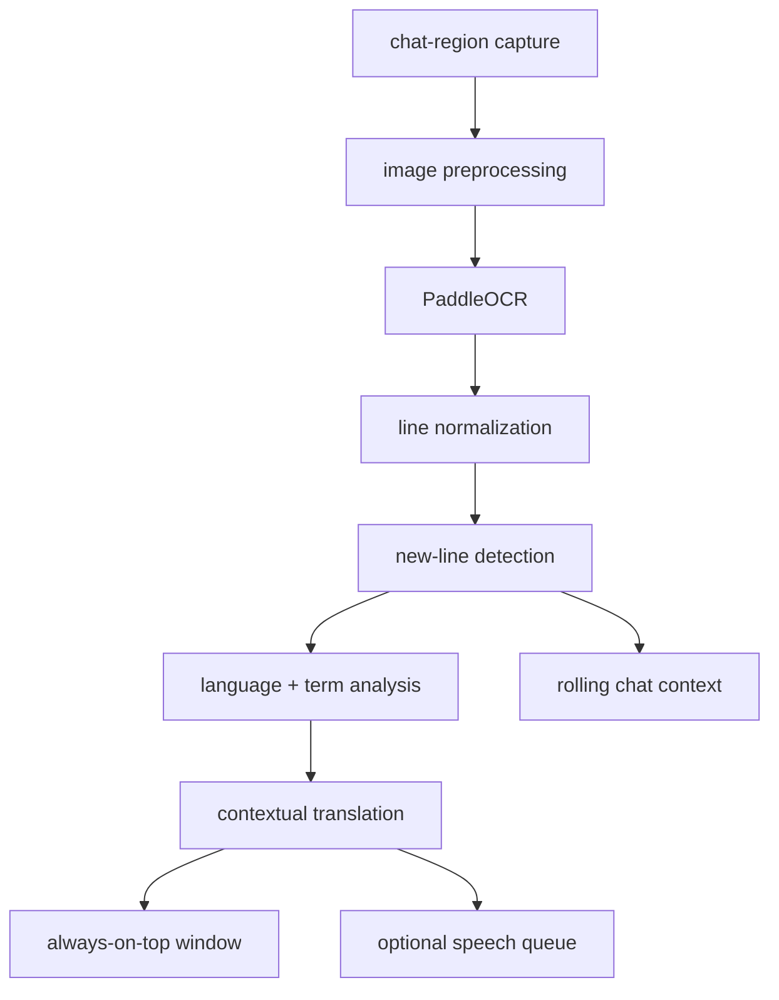

# stalzone chat translator — project architecture

status: planning  
target platform: windows 10/11  
primary use case: detect and translate multilingual stalzone chat into natural gamer english, preserving slang, tone, profanity, game terminology, names, and formatting, then display and optionally read it aloud.

## 1. product goal

build a small external desktop companion that:

- captures only a user-selected chat region.
- recognizes Cyrillic and Latin-script chat, with expandable language packs.
- detects newly appeared chat lines without repeating old ones.
- detects the language of each message, including mixed-language messages.
- translates intended meaning into concise, natural gamer English instead of awkward literal English.
- uses recent conversation context and a stalzone glossary to resolve slang and game terms.
- shows translations in a separate always-on-top window.
- optionally reads translations aloud.
- never reads game memory, injects code, hooks rendering, or automates game input.

## 2. v1 scope

### included

- windows desktop application.
- one-time drag-to-select chat region, with manual coordinate editing.
- capture every 400–750 ms while enabled.
- image preprocessing tuned for stalzone chat.
- multilingual OCR with Cyrillic and Latin enabled by default.
- new-line detection and duplicate suppression.
- contextual online translation first, with fast and offline translation modes available later.
- compact always-on-top translation window.
- start/stop, mute/unmute, and clear-history hotkeys.
- settings persisted locally.
- local logs useful for debugging OCR accuracy.

### excluded from v1

- game-process access, DLL injection, renderer hooks, or memory reading.
- automatic replies or simulated keyboard input.
- translation of the entire screen.
- macOS or Linux support.
- cloud accounts, syncing, or analytics.
- packaging through the Microsoft Store.

## 3. recommended stack

| area | v1 choice | reason |
| --- | --- | --- |
| language | Python 3.12 | fastest path to a reliable Windows prototype |
| capture | `dxcam`, with `mss` fallback | fast DirectX capture; fallback improves compatibility |
| image processing | OpenCV + Pillow | thresholding, scaling, color masks, and debug images |
| OCR | PaddleOCR with script/language routing | strong Cyrillic support with expandable multilingual models |
| language identification | CLD3 or fastText, plus script heuristics | fast per-message detection with mixed-language fallback |
| contextual translation | LLM translation adapter | best handling of slang, typos, context, profanity, and game terminology |
| fast translation | Google or DeepL adapter | lower latency fallback for straightforward lines |
| offline translation | Argos Translate adapter | optional privacy/offline mode |
| text-to-speech | `pyttsx3` initially | offline and built into the local app flow |
| UI | PySide6 | better window, tray, hotkey, and packaging support than tkinter |
| global hotkeys | `pynput` | configurable controls outside the focused window |
| settings | JSON via Pydantic models | typed validation without a database |
| packaging | PyInstaller | produces a distributable Windows executable |
| tests | pytest | unit and integration coverage |

the OCR, language-identification, translation, glossary, and speech engines will sit behind interfaces. providers can be replaced without changing capture, line tracking, or the UI.

translation modes:

| mode | behavior | tradeoff |
| --- | --- | --- |
| contextual | recent chat + glossary + natural-language translation | best quality; higher latency/cost |
| fast | translate the current line with glossary substitutions | faster; weaker on slang and ambiguity |
| offline | local models only | private; largest install and weakest slang support |

## 4. system flow



## 5. component responsibilities

### `capture`

- capture only the configured monitor and rectangle.
- account for Windows display scaling and multi-monitor coordinates.
- return frames with timestamps.
- pause cleanly when capture is disabled or the game is minimized.

### `preprocess`

- upscale the crop 2× or 3×.
- optionally isolate likely chat-text colors.
- improve contrast and sharpness.
- expose several preprocessing profiles because chat backgrounds vary.
- save debug frames only when diagnostic mode is enabled.

### `ocr`

- recognize Cyrillic and Latin text by default.
- allow additional OCR language packs without changing the pipeline.
- preserve mixed-script spans, item names, usernames, numbers, symbols, and emoticons.
- return text, confidence, and bounding boxes.
- group OCR fragments into visual lines from top to bottom.
- reject very low-confidence fragments and obvious UI noise.

### `line_tracker`

- normalize whitespace and harmless punctuation differences.
- compare current lines against a rolling history, not a permanent `set`.
- use fuzzy similarity plus vertical order to survive minor OCR changes.
- emit only genuinely new lines.
- expire old fingerprints after a configurable period.

this avoids the main flaw in the minimal prototype: a permanent `seen` set would suppress a legitimate repeated message forever and would grow without bound.

### `translator`

- detect language per message rather than assuming Russian.
- handle code-switching and mixed-language spans inside one message.
- use 3–10 recent messages as bounded conversational context when useful.
- translate intended meaning, not word-for-word grammar.
- preserve tone, profanity strength, jokes, insults, laughter, emoticons, and repeated punctuation.
- correct obvious source-language typos internally without rewriting the displayed source.
- preserve player names, numbers, item names, map names, factions, abbreviations, and game terms.
- never sanitize a message merely because it is rude or profane.
- support an optional literal-translation detail view for debugging.
- enforce timeouts and retry transient failures.
- cache recent translations.
- return the original line unchanged when translation is disabled or unavailable.

example target behavior:

| source | natural output |
| --- | --- |
| `ты куда идёшь?` | `where are you going?` |
| `нужно хотябы мне потестить сканер` | `i at least need to test out the scanner` |
| `mahmut naber` | `mahmut, what's up?` |
| `ххехех` | `hehehe` |

### `game_glossary`

- ship with a versioned stalzone terminology file.
- store canonical English names plus Russian, Turkish, transliterated, abbreviated, and misspelled aliases.
- cover maps, factions, artifacts, weapons, armor, events, anomalies, currencies, resources, and common community shorthand.
- prefer official in-game English names when a term has one.
- protect glossary matches from being mistranslated as ordinary words.
- allow user corrections from the UI and save them locally.
- track glossary version separately from the application version.

### `context_manager`

- retain a short rolling window of source messages and accepted translations.
- keep speaker, channel, timestamp, detected language, and message direction metadata.
- send only the minimum context needed by contextual translation.
- expire old context and never grow without bound.
- allow context to be cleared instantly from the UI.

### `speech`

- use a non-blocking queue so speech never stalls capture or OCR.
- allow mute, volume, voice, rate, and queue-length controls.
- drop stale messages if speech falls too far behind.

### `ui`

- setup screen for selecting the capture rectangle.
- live preview with OCR bounding boxes in diagnostic mode.
- compact always-on-top translation window.
- system-tray controls and clear status indicators.
- configurable hotkeys and translation/TTS toggles.

### `storage`

- store settings in `%APPDATA%/StalzoneChatTranslator/config.json`.
- keep normal operation local and ephemeral.
- write rotating diagnostic logs with no screenshots by default.
- provide an explicit export-debug-bundle action.

## 6. concurrency model

the UI thread must never run OCR, translation, or TTS directly.

| worker | responsibility | queue behavior |
| --- | --- | --- |
| capture worker | produce the newest cropped frame | capacity 1; replace stale frame |
| OCR worker | preprocess and recognize text | consume latest frame only |
| translation worker | translate new lines | bounded FIFO |
| speech worker | read translated messages | bounded FIFO; drop stale items |
| UI thread | render status and translations | receive signals/events only |

## 7. proposed repository layout

```text
stalzone-chat-translator/
├── README.md
├── project_architecture.md
├── pyproject.toml
├── requirements.lock
├── src/
│   └── stalzone_translator/
│       ├── __main__.py
│       ├── app.py
│       ├── models.py
│       ├── settings.py
│       ├── capture/
│       │   ├── base.py
│       │   ├── dxcam_capture.py
│       │   └── mss_capture.py
│       ├── vision/
│       │   ├── preprocess.py
│       │   ├── paddle_ocr.py
│       │   └── line_tracker.py
│       ├── language/
│       │   ├── detector.py
│       │   ├── mixed_script.py
│       │   └── glossary.py
│       ├── translation/
│       │   ├── base.py
│       │   ├── contextual.py
│       │   ├── fast_translate.py
│       │   └── argos_translate.py
│       ├── speech/
│       │   ├── base.py
│       │   └── windows_tts.py
│       └── ui/
│           ├── main_window.py
│           ├── region_selector.py
│           ├── translation_window.py
│           └── tray.py
├── tests/
│   ├── fixtures/
│   ├── test_preprocess.py
│   ├── test_line_tracker.py
│   ├── test_language_detection.py
│   ├── test_glossary.py
│   ├── test_translation.py
│   └── test_settings.py
├── scripts/
│   ├── capture_fixture.py
│   └── build_windows.ps1
└── assets/
    ├── app.ico
    └── glossary/
        └── stalzone.en.json
```

## 8. configuration model

```json
{
  "capture": {
    "backend": "dxcam",
    "monitor": 0,
    "left": 20,
    "top": 930,
    "width": 650,
    "height": 130,
    "interval_ms": 500
  },
  "ocr": {
    "scripts": ["cyrillic", "latin"],
    "preferred_languages": ["ru", "en", "tr"],
    "minimum_confidence": 0.45,
    "preprocess_profile": "stalzone_default"
  },
  "translation": {
    "enabled": true,
    "mode": "contextual",
    "provider": "llm",
    "source": "auto",
    "target": "en",
    "style": "natural_gamer",
    "context_messages": 6,
    "preserve_profanity": true,
    "show_literal_translation": false,
    "glossary": "stalzone.en"
  },
  "speech": {
    "enabled": false,
    "rate": 185,
    "volume": 0.9
  },
  "hotkeys": {
    "toggle_capture": "ctrl+shift+t",
    "toggle_speech": "ctrl+shift+m",
    "clear_history": "ctrl+shift+l"
  }
}
```

## 9. new-line detection design

1. sort OCR boxes by vertical position.
2. merge nearby fragments into visual lines.
3. normalize whitespace, Unicode, and repeated punctuation.
4. generate a comparison form that removes unstable OCR artifacts without changing the displayed text.
5. align the current frame's lines with the previous frame using fuzzy similarity.
6. emit lines that do not align with recent visible or recently emitted lines.
7. keep a short rolling history so identical messages can legitimately appear again later.

initial thresholds will be tuned against captured screenshots rather than guessed permanently.

## 10. translation policy

the default `natural_gamer` policy is part of the product contract:

1. identify the speaker, channel, message body, language, and protected game terms.
2. interpret slang, typos, abbreviations, transliteration, and recent conversational context.
3. translate the meaning into short, normal English a player would actually say.
4. preserve hostility, humor, uncertainty, profanity strength, emoticons, and punctuation intensity.
5. retain canonical stalzone terms and player names exactly.
6. do not add explanations inside the overlay unless the source is genuinely ambiguous.
7. expose the raw OCR text and literal translation only in an expandable debug/detail view.

## 11. safety and compatibility constraints

- capture through normal Windows screen-capture APIs only.
- use a separate top-level window; do not inject an in-game overlay.
- do not inspect the game process, memory, files, or network traffic.
- do not send keystrokes or automate gameplay.
- make online translation opt-in and clearly indicate when text leaves the computer.
- provide an offline mode for users who do not want chat text sent to a translation service.
- do not claim anti-cheat approval without written confirmation from the game publisher. external capture is lower risk, not guaranteed risk-free.

## 12. milestones

| milestone | deliverable | completion test |
| --- | --- | --- |
| m0 — fixtures | representative chat screenshots plus ground-truth annotations | includes multiple languages, slang, typos, profanity, game terms, names, colors, channels, and noisy backgrounds |
| m1 — OCR CLI | crop screenshot and print ordered lines | target messages are readable on fixture set |
| m2 — live detector | capture region and emit only new lines | no repeats while unchanged; repeated messages work later |
| m3 — language and glossary | detect language and protect canonical terms | mixed Russian/English/Turkish fixtures resolve correctly |
| m4 — contextual translation | translate into natural gamer English | slang, tone, profanity, and game-term rubric passes |
| m5 — desktop UI | selector, translation window, tray, settings | usable without editing source or JSON |
| m6 — speech | optional queued TTS with hotkey | OCR remains responsive during speech |
| m7 — hardening | tests, logs, scaling, multi-monitor support | passes fixture and manual gameplay tests |
| m8 — packaging | signed-ready Windows build artifact | clean-machine install/run instructions verified |

## 13. performance targets

- new translation displayed within 1.5 seconds of a line becoming visible, excluding slow network responses.
- under 10% average CPU on a typical modern gaming PC after tuning.
- bounded memory usage during multi-hour sessions.
- no duplicate translation for a static line across consecutive frames.
- capture and processing stop immediately when paused.

## 14. testing strategy

- unit tests for normalization, grouping, fuzzy matching, cache expiry, settings, and provider fallbacks.
- golden-image tests using cropped and full-screen chat screenshots.
- every fixture stores raw OCR ground truth, normalized source, language tags, protected terms, and expected natural translation.
- translation quality rubric: meaning, naturalness, slang, tone/profanity, term preservation, and no invented content.
- regression set for Russian, English, Turkish, code-switching, transliteration, deliberate misspellings, laughter, emoticons, and wrapped messages.
- integration tests with recorded frame sequences that simulate chat scrolling.
- manual tests for fullscreen-windowed mode, DPI scaling, multiple monitors, alt-tab, and game minimization.
- packaging smoke test on a Windows machine without Python installed.

## 15. decisions still needed

these should be resolved with real screenshots and user preference before their milestone begins:

1. exact stalzone resolution, display scaling, and fullscreen mode.
2. preferred translation mode and acceptable per-message online cost.
3. whether translations should include the original source-language line.
4. translation-window position, number of visible lines, font size, and opacity.
5. whether TTS should read every translated line or only lines matching filters.
6. whether player names and faction/channel labels use consistent colors that preprocessing can exploit.

## 16. fixture ingestion

screenshots from other ChatGPT chats are useful source material, but they must be made available as actual image files to become reliable automated test fixtures. remembered summaries are not a substitute for pixels or ground-truth annotations.

preferred ingestion order:

1. attach original screenshots to this project/chat or add them to project sources.
2. keep an unmodified private fixture copy during development.
3. annotate each fixture with exact source text, language, natural translation, protected terms, and notes.
4. publish screenshots to the public GitHub repository only after an explicit privacy review; usernames and chat content may be public.

## 17. immediate next step

collect 10–20 uncropped stalzone screenshots at the user's actual resolution, covering:

- Russian, English, Turkish, and other encountered languages.
- mixed-language and transliterated messages.
- slang, profanity, typos, abbreviations, jokes, and insults.
- game terms with known canonical English names.
- repeated messages.
- chat scrolling by one and several lines.
- different locations/background brightness.
- player names, system messages, and channel labels.

these become the permanent OCR fixture set and determine preprocessing and deduplication thresholds for m1.

## 18. architecture decision log

| date | decision | rationale |
| --- | --- | --- |
| 2026-08-20 | windows-only v1 | matches the target game environment and minimizes platform complexity |
| 2026-08-20 | separate always-on-top window | avoids injection and is easier to debug and package |
| 2026-08-20 | PaddleOCR as primary OCR | strong Cyrillic support and trainable preprocessing pipeline |
| 2026-08-20 | PySide6 instead of tkinter | stronger desktop UX, tray integration, and worker signaling |
| 2026-08-20 | rolling fuzzy line tracker | handles chat scrolling and OCR instability better than a permanent exact-match set |
| 2026-08-20 | provider interfaces | keeps OCR, translation, capture, and speech engines replaceable |
| 2026-08-20 | multilingual, message-level language detection | real chat already includes Russian, English, Turkish, and mixed text |
| 2026-08-20 | natural gamer English policy | literal translation loses slang, tone, profanity, and conversational intent |
| 2026-08-20 | versioned stalzone glossary | canonical game names must survive translation and community misspellings |
| 2026-08-20 | bounded conversational context | previous lines resolve ambiguity without unbounded data retention |
