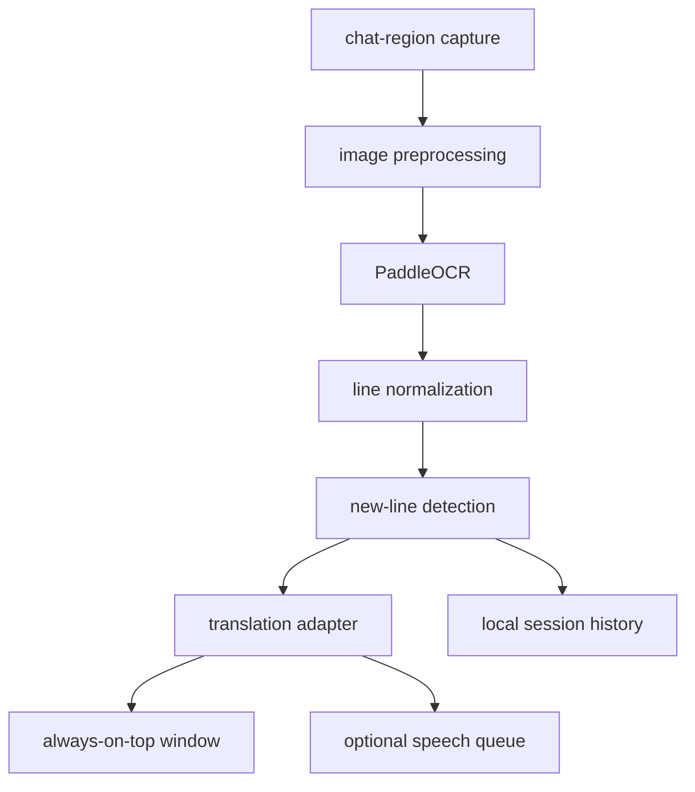

# stalzone chat translator — project architecture

status: planning  
target platform: windows 10/11  
primary use case: translate new russian chat messages in the bottom-left of stalzone into english, then display and optionally read them aloud.

## 1. product goal

build a small external desktop companion that:

- captures only a user-selected chat region.
- recognizes russian and english chat text.
- detects newly appeared chat lines without repeating old ones.
- translates russian to natural english.
- shows translations in a separate always-on-top window.
- optionally reads translations aloud.
- never reads game memory, injects code, hooks rendering, or automates game input.

## 2. v1 scope

### included

- windows desktop application.
- one-time drag-to-select chat region, with manual coordinate editing.
- capture every 400–750 ms while enabled.
- image preprocessing tuned for stalzone chat.
- russian/english OCR.
- new-line detection and duplicate suppression.
- online translation first, with an offline translation option later.
- compact always-on-top translation window.
- start/stop, mute/unmute, and clear-history hotkeys.
- settings persisted locally.
- local logs useful for debugging OCR accuracy.

### excluded from v1

- game-process access, DLL injection, renderer hooks, or memory reading.
- automatic replies or simulated keyboard input.
- translation of the entire screen.
- macOS or Linux support.
- cloud accounts, syncing, or analytics.
- packaging through the Microsoft Store.

## 3. recommended stack

| area | v1 choice | reason |
| --- | --- | --- |
| language | Python 3.12 | fastest path to a reliable Windows prototype |
| capture | `dxcam`, with `mss` fallback | fast DirectX capture; fallback improves compatibility |
| image processing | OpenCV + Pillow | thresholding, scaling, color masks, and debug images |
| OCR | PaddleOCR | generally stronger Cyrillic recognition than EasyOCR |
| translation | Google Translate adapter initially | simple setup and good Russian coverage |
| offline translation | Argos Translate adapter | optional privacy/offline mode |
| text-to-speech | `pyttsx3` initially | offline and built into the local app flow |
| UI | PySide6 | better window, tray, hotkey, and packaging support than tkinter |
| global hotkeys | `pynput` | configurable controls outside the focused window |
| settings | JSON via Pydantic models | typed validation without a database |
| packaging | PyInstaller | produces a distributable Windows executable |
| tests | pytest | unit and integration coverage |

the translation and speech engines will sit behind interfaces so Google Translate can later be replaced by DeepL, Argos, Edge TTS, or ElevenLabs without changing the OCR pipeline.

## 4. system flow



## 5. component responsibilities

### `capture`

- capture only the configured monitor and rectangle.
- account for Windows display scaling and multi-monitor coordinates.
- return frames with timestamps.
- pause cleanly when capture is disabled or the game is minimized.

### `preprocess`

- upscale the crop 2× or 3×.
- optionally isolate likely chat-text colors.
- improve contrast and sharpness.
- expose several preprocessing profiles because chat backgrounds vary.
- save debug frames only when diagnostic mode is enabled.

### `ocr`

- recognize Cyrillic and Latin text.
- return text, confidence, and bounding boxes.
- group OCR fragments into visual lines from top to bottom.
- reject very low-confidence fragments and obvious UI noise.

### `line_tracker`

- normalize whitespace and harmless punctuation differences.
- compare current lines against a rolling history, not a permanent `set`.
- use fuzzy similarity plus vertical order to survive minor OCR changes.
- emit only genuinely new lines.
- expire old fingerprints after a configurable period.

this avoids the main flaw in the minimal prototype: a permanent `seen` set would suppress a legitimate repeated message forever and would grow without bound.

### `translator`

- detect whether a line contains enough Cyrillic to require translation.
- preserve player names, numbers, and common game terms where possible.
- enforce timeouts and retry transient failures.
- cache recent translations.
- return the original line unchanged when translation is disabled or unavailable.

### `speech`

- use a non-blocking queue so speech never stalls capture or OCR.
- allow mute, volume, voice, rate, and queue-length controls.
- drop stale messages if speech falls too far behind.

### `ui`

- setup screen for selecting the capture rectangle.
- live preview with OCR bounding boxes in diagnostic mode.
- compact always-on-top translation window.
- system-tray controls and clear status indicators.
- configurable hotkeys and translation/TTS toggles.

### `storage`

- store settings in `%APPDATA%/StalzoneChatTranslator/config.json`.
- keep normal operation local and ephemeral.
- write rotating diagnostic logs with no screenshots by default.
- provide an explicit export-debug-bundle action.

## 6. concurrency model

the UI thread must never run OCR, translation, or TTS directly.

| worker | responsibility | queue behavior |
| --- | --- | --- |
| capture worker | produce the newest cropped frame | capacity 1; replace stale frame |
| OCR worker | preprocess and recognize text | consume latest frame only |
| translation worker | translate new lines | bounded FIFO |
| speech worker | read translated messages | bounded FIFO; drop stale items |
| UI thread | render status and translations | receive signals/events only |

## 7. proposed repository layout

```text
stalzone-chat-translator/
├── README.md
├── project_architecture.md
├── pyproject.toml
├── requirements.lock
├── src/
│   └── stalzone_translator/
│       ├── __main__.py
│       ├── app.py
│       ├── models.py
│       ├── settings.py
│       ├── capture/
│       │   ├── base.py
│       │   ├── dxcam_capture.py
│       │   └── mss_capture.py
│       ├── vision/
│       │   ├── preprocess.py
│       │   ├── paddle_ocr.py
│       │   └── line_tracker.py
│       ├── translation/
│       │   ├── base.py
│       │   ├── google_translate.py
│       │   └── argos_translate.py
│       ├── speech/
│       │   ├── base.py
│       │   └── windows_tts.py
│       └── ui/
│           ├── main_window.py
│           ├── region_selector.py
│           ├── translation_window.py
│           └── tray.py
├── tests/
│   ├── fixtures/
│   ├── test_preprocess.py
│   ├── test_line_tracker.py
│   ├── test_translation.py
│   └── test_settings.py
├── scripts/
│   ├── capture_fixture.py
│   └── build_windows.ps1
└── assets/
    └── app.ico
```

## 8. configuration model

```json
{
  "capture": {
    "backend": "dxcam",
    "monitor": 0,
    "left": 20,
    "top": 930,
    "width": 650,
    "height": 130,
    "interval_ms": 500
  },
  "ocr": {
    "languages": ["ru", "en"],
    "minimum_confidence": 0.45,
    "preprocess_profile": "stalzone_default"
  },
  "translation": {
    "enabled": true,
    "provider": "google",
    "source": "auto",
    "target": "en"
  },
  "speech": {
    "enabled": false,
    "rate": 185,
    "volume": 0.9
  },
  "hotkeys": {
    "toggle_capture": "ctrl+shift+t",
    "toggle_speech": "ctrl+shift+m",
    "clear_history": "ctrl+shift+l"
  }
}
```

## 9. new-line detection design

1. sort OCR boxes by vertical position.
2. merge nearby fragments into visual lines.
3. normalize whitespace, Unicode, and repeated punctuation.
4. generate a comparison form that removes unstable OCR artifacts without changing the displayed text.
5. align the current frame's lines with the previous frame using fuzzy similarity.
6. emit lines that do not align with recent visible or recently emitted lines.
7. keep a short rolling history so identical messages can legitimately appear again later.

initial thresholds will be tuned against captured screenshots rather than guessed permanently.

## 10. safety and compatibility constraints

- capture through normal Windows screen-capture APIs only.
- use a separate top-level window; do not inject an in-game overlay.
- do not inspect the game process, memory, files, or network traffic.
- do not send keystrokes or automate gameplay.
- make online translation opt-in and clearly indicate when text leaves the computer.
- provide an offline mode for users who do not want chat text sent to a translation service.
- do not claim anti-cheat approval without written confirmation from the game publisher. external capture is lower risk, not guaranteed risk-free.

## 11. milestones

| milestone | deliverable | completion test |
| --- | --- | --- |
| m0 — fixtures | representative chat screenshots | includes Russian, English, names, colored text, and noisy backgrounds |
| m1 — OCR CLI | crop screenshot and print ordered lines | target messages are readable on fixture set |
| m2 — live detector | capture region and emit only new lines | no repeats while unchanged; repeated messages work later |
| m3 — translation | translate emitted Russian lines | errors time out cleanly and do not stop capture |
| m4 — desktop UI | selector, translation window, tray, settings | usable without editing source or JSON |
| m5 — speech | optional queued TTS with hotkey | OCR remains responsive during speech |
| m6 — hardening | tests, logs, scaling, multi-monitor support | passes fixture and manual gameplay tests |
| m7 — packaging | signed-ready Windows build artifact | clean-machine install/run instructions verified |

## 12. performance targets

- new translation displayed within 1.5 seconds of a line becoming visible, excluding slow network responses.
- under 10% average CPU on a typical modern gaming PC after tuning.
- bounded memory usage during multi-hour sessions.
- no duplicate translation for a static line across consecutive frames.
- capture and processing stop immediately when paused.

## 13. testing strategy

- unit tests for normalization, grouping, fuzzy matching, cache expiry, settings, and provider fallbacks.
- golden-image tests using cropped chat screenshots.
- integration tests with recorded frame sequences that simulate chat scrolling.
- manual tests for fullscreen-windowed mode, DPI scaling, multiple monitors, alt-tab, and game minimization.
- packaging smoke test on a Windows machine without Python installed.

## 14. decisions still needed

these should be resolved with real screenshots and user preference before their milestone begins:

1. exact stalzone resolution, display scaling, and fullscreen mode.
2. preferred translation mode: easiest online service, API-key service, or fully offline.
3. whether translations should include the original Russian line.
4. translation-window position, number of visible lines, font size, and opacity.
5. whether TTS should read every translated line or only lines matching filters.
6. whether player names and faction/channel labels use consistent colors that preprocessing can exploit.

## 15. immediate next step

collect 10–20 uncropped stalzone screenshots at the user's actual resolution, covering:

- Russian-only messages.
- mixed Russian/English messages.
- repeated messages.
- chat scrolling by one and several lines.
- different locations/background brightness.
- player names, system messages, and channel labels.

these become the permanent OCR fixture set and determine preprocessing and deduplication thresholds for m1.

## 16. architecture decision log

| date | decision | rationale |
| --- | --- | --- |
| 2026-08-20 | windows-only v1 | matches the target game environment and minimizes platform complexity |
| 2026-08-20 | separate always-on-top window | avoids injection and is easier to debug and package |
| 2026-08-20 | PaddleOCR as primary OCR | strong Cyrillic support and trainable preprocessing pipeline |
| 2026-08-20 | PySide6 instead of tkinter | stronger desktop UX, tray integration, and worker signaling |
| 2026-08-20 | rolling fuzzy line tracker | handles chat scrolling and OCR instability better than a permanent exact-match set |
| 2026-08-20 | provider interfaces | keeps OCR, translation, capture, and speech engines replaceable |
